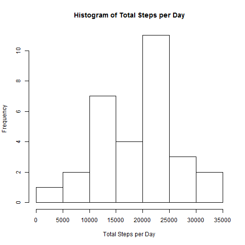
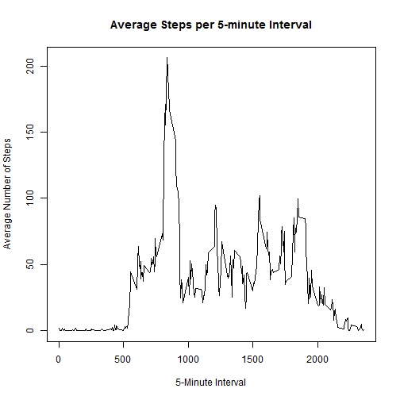
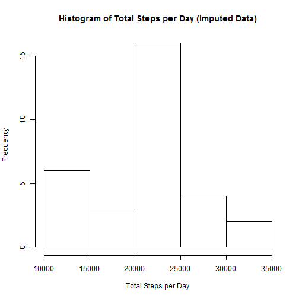
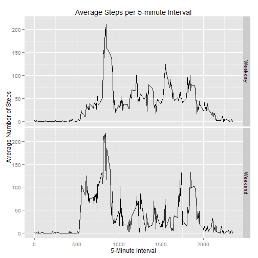

## Reproducible Research: Peer Assessment 1

---

### 1. Loading and preprocessing the data

**1.1 Load the raw data into R**


```r
rawData <- read.csv(unz("activity.zip", "activity.csv"))
head(rawData, n=3)
```

```
##   steps       date interval
## 1    NA 2012-10-01        0
## 2    NA 2012-10-01        5
## 3    NA 2012-10-01       10
```

```r
str(rawData)
```

```
## 'data.frame':	17568 obs. of  3 variables:
##  $ steps   : int  NA NA NA NA NA NA NA NA NA NA ...
##  $ date    : Factor w/ 61 levels "2012-10-01","2012-10-02",..: 1 1 1 1 1 1 1 1 1 1 ...
##  $ interval: int  0 5 10 15 20 25 30 35 40 45 ...
```

**1.2 Process/transform the data**

Format the date (change from factor to date) and remove the rows with NA values


```r
rawData$date <- as.Date(rawData$date)
completeRows <- complete.cases(rawData)
data <- rawData[completeRows,]
head(data, n=3)
```

```
##     steps       date interval
## 289     0 2012-10-02        0
## 290     0 2012-10-02        5
## 291     0 2012-10-02       10
```

```r
str(data)
```

```
## 'data.frame':	15264 obs. of  3 variables:
##  $ steps   : int  0 0 0 0 0 0 0 0 0 0 ...
##  $ date    : Date, format: "2012-10-02" "2012-10-02" ...
##  $ interval: int  0 5 10 15 20 25 30 35 40 45 ...
```

---

### 2. What is the mean total number of steps taken per day?

**2.1 Make a histogram of the total number of steps taken each day**


```r
library(lubridate)
data$day <- day(data$date)
stepsPerDay <- aggregate(steps ~ day, data, sum)
hist(stepsPerDay$steps, main="Histogram of Total Steps per Day", xlab="Total Steps per Day")
```

 

**2.2 Calculate and report the mean and median total number of steps taken per day**


```r
report <- data.frame(Mean.PerDay=mean(stepsPerDay$steps), Median.PerDay=median(stepsPerDay$steps))
rownames(report)<-"Remove_NAs"
report
```

```
##            Mean.PerDay Median.PerDay
## Remove_NAs       19020         20598
```

---

### 3. What is the average daily activity pattern?

**3.1 Make a time series plot of the average number of steps taken on each 5-minute interval**


```r
stepsPerInterval <- aggregate(steps ~ interval, data, mean)
plot(stepsPerInterval$interval, stepsPerInterval$steps, type="l", 
     main="Average Steps per 5-minute Interval", xlab="5-Minute Interval", ylab="Average Number of Steps")
```

 

**3.2 Which 5-minute interval contains the maximum number of steps? (averaged across all the days in the dataset)**


```r
stepsPerInterval[which.max(stepsPerInterval$steps),]
```

```
##     interval steps
## 104      835 206.2
```

---

### 4. Imputing missing values

**4.1 Calculate and report the total number of missing values in the dataset**


```r
sum(!complete.cases(rawData))
```

```
## [1] 2304
```

**4.2 Devise a strategy for filling in all of the missing values in the dataset**

I will replace the missing values with the mean steps of the corresponding 5-minute interval. 

Code is in next bullet

**4.3 Create a new dataset that is equal to the original dataset but with the missing data filled in**

Make a new data set where NAs will be replaced

```r
imputeData <- rawData
```

For each row in the data, find the index of the interval in 'stepsPerInterval'

```r
auxInterval <- array(imputeData$interval)
index <- apply(auxInterval, 1, function(x) which(stepsPerInterval$interval==x))
```

Replace the NAs with the mean steps of the corresponding 5-minute interval

```r
missing <- is.na(imputeData$steps)
imputeData[missing,"steps"] <- stepsPerInterval[ index[missing], "steps"]
head(imputeData, n=3)
```

```
##    steps       date interval
## 1 1.7170 2012-10-01        0
## 2 0.3396 2012-10-01        5
## 3 0.1321 2012-10-01       10
```

```r
str(imputeData)
```

```
## 'data.frame':	17568 obs. of  3 variables:
##  $ steps   : num  1.717 0.3396 0.1321 0.1509 0.0755 ...
##  $ date    : Date, format: "2012-10-01" "2012-10-01" ...
##  $ interval: int  0 5 10 15 20 25 30 35 40 45 ...
```

**4.4 Make a histogram of the total number of steps taken each day**


```r
imputeData$day <- day(imputeData$date)
imputeStepsPerDay <- aggregate(steps ~ day, imputeData, sum)
hist(imputeStepsPerDay$steps, main="Histogram of Total Steps per Day (Imputed Data)", xlab="Total Steps per Day")
```

 

**4.5 Calculate and report the mean and median total number of steps taken per day**


```r
report <- rbind(report, c(mean(imputeStepsPerDay$steps), median(imputeStepsPerDay$steps)))
rownames(report)[2] <- "Impute_NAs"
report
```

```
##            Mean.PerDay Median.PerDay
## Remove_NAs       19020         20598
## Impute_NAs       21185         21641
```

**4.6 Do these values differ from the estimates from the first part of the assignment? What is the impact of imputing missing data on the estimates of the total daily number of steps?**

The table above shows that the mean and median steps per day are different.

Both values are higher when the NAs are imputed than when they are removed from the data. 

The increase (by quantile) caused by imputing the NAs instead of removing them is shown below


```r
summary(imputeStepsPerDay$steps) - summary(stepsPerDay$steps)
```

```
##    Min. 1st Qu.  Median    Mean 3rd Qu.    Max. 
##    6980    5700    1000    2200     100       0
```

---

### 5. Are there differences in activity patterns between weekdays and weekends?

**5.1 Create a factor variable indicating whether a given date is a weekday or weekend day**


```r
weekday <- as.numeric(factor(weekdays(imputeData$date)))
weekDayType <- apply( array(weekday), 1, function(x) { if( x <= 5) 1 else 2 })
imputeData$weekDayType <- factor(weekDayType, labels=c("Weekday", "Weekend"))
head(imputeData, n=3)
```

```
##    steps       date interval day weekDayType
## 1 1.7170 2012-10-01        0   1     Weekday
## 2 0.3396 2012-10-01        5   1     Weekday
## 3 0.1321 2012-10-01       10   1     Weekday
```

```r
str(imputeData)
```

```
## 'data.frame':	17568 obs. of  5 variables:
##  $ steps      : num  1.717 0.3396 0.1321 0.1509 0.0755 ...
##  $ date       : Date, format: "2012-10-01" "2012-10-01" ...
##  $ interval   : int  0 5 10 15 20 25 30 35 40 45 ...
##  $ day        : int  1 1 1 1 1 1 1 1 1 1 ...
##  $ weekDayType: Factor w/ 2 levels "Weekday","Weekend": 1 1 1 1 1 1 1 1 1 1 ...
```

**5.2 Make a time series plot of the average number of steps taken on each 5-minute interval for weekdays and weekends**


```r
stepsPerInterval <- aggregate(steps ~ interval + weekDayType, imputeData, mean)
library(ggplot2)
qplot(data=stepsPerInterval, x=interval, y=steps, facets = weekDayType ~ . ,  geom="line",
     main="Average Steps per 5-minute Interval", xlab="5-Minute Interval", ylab="Average Number of Steps")
```

 
